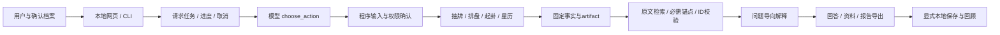

# 项目展示材料 · v0.4.0

打开 [演示幻灯页](index.html) 即可展示，支持左右方向键、页码导航和打印。全部截图来自合成资料；没有密钥或真实用户档案。

## 三分钟介绍

Fortune Agent是一个面向传统占卜与反思场景的工具型Agent项目。模型负责识别意图、补问资料和组织解释，程序负责抽牌、历法、星盘与原文选取。项目的技术重点是让工具结果稳定、解释有来源、缺资料不猜测，并通过可复现测试检查行为。

目前支持塔罗、每日提示、八字、周易、紫微本命盘与西方占星。它有本地档案确认、后台阶段、合作式取消、原结果重试、资料检索和隐私预览导出。占卜的文化解释不被当作现实预测证明。

## 六分钟操作演示

| 时段 | 操作 | 展示重点 |
| --- | --- | --- |
| 0:00–0:45 | 统一对话问“用八字梳理论文修改，我还没提供出生时刻” | 补问，不默认午夜 |
| 0:45–1:30 | 创建合成档案2000-01-01 12:00 +08:00，预览并确认 | 明确资料复用，不凭代号静默采用 |
| 1:30–2:20 | 塔罗三张，提出学习问题，背牌选择后追问 | 服务端固定牌面，追问不重抽 |
| 2:20–3:10 | 紫微命宫原文筛选／占星点选太阳 | 固定引用ID、黄经锚点与可视化 |
| 3:10–4:00 | 搜索“正财格救应”，再搜“穷通宝鉴” | 匹配原因与缺原文说明 |
| 4:00–4:45 | 导出报告，先匿名预览，再保存PDF | 明确出生字段默认隐藏，分享前复核 |
| 4:45–6:00 | 展示评估与CI | 首轮19/20，失败与修正题目分别报告；不夸大命理准确率 |

真实模型调用需要API环境并可能收费。若演示现场网络不稳，使用离线手动工具和本页截图；不要把离线截图讲成现场模型运行。取消不能保证服务商停止当前请求或计费。

## 架构说明

## 评估与限制

v0.4.0发布前全量222项测试通过，CI运行Python3.11/3.13、Docker和桌面/手机浏览器。真实Agent扩大为20组，首轮19组满足机制检查；周易例原题含糊及完整引用冲突分别保留记录，修正为明确任务分工后另行复跑通过。不能把复跑混进首轮宣称100%。见 [完整评估](../../evals/results/retrieval-export-calibration-review-2026-10-06.md)。

八字校准仅有六个合成结构锚点、四组阈值审计，独立专家标签为0。数值权重不冒充古籍标准，参数敏感时暂停喜用选定。紫微只有27条固定电子摘录，未完成纸本全书校勘；占星固定热带整宫十大天体。尚无公网账户认证，不建议直接暴露给多人公共服务。

## 可作为研究问题的方向

- 比较确认资料前后，错误补填与重复询问是否减少。
- 比较全量上下文与必需锚点加检索，引用覆盖、成本和错误率是否变化。
- 用带失败注入的请求验证取消、重试与artifact稳定性。
- 在获得明确流派的独立专家标注后，再评估八字模型参数；不使用自身模型输出作为真值。

本项目当前没有做上述比较实验的因果结论，也没有独立验证占卜预测效力。
