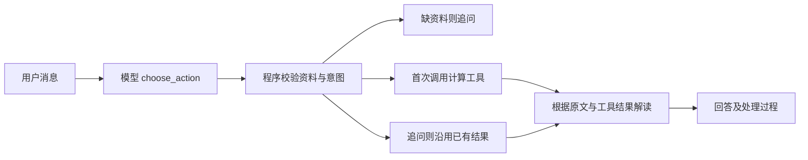

# 统一对话 Agent

统一入口支持自然语言选择塔罗、每日提示、八字与周易，补齐必要资料，并围绕同一次结果追问。网页新增“统一对话”，原有四个手动页面仍可使用。每次发送都会调用中转站，澄清和功能介绍也可能产生一次路由请求费用。

## 一轮怎样执行

模型先通过 `choose_action` 函数工具返回下一步：读取结果、追问已有结果、补充资料、简短回答或说明不支持。路由包含用户已提供的问题、四柱或出生时间、牌阵、硬币结果和风格；程序再次校验。

程序随后调用已有计算工具。缺资料时不执行排盘或抽牌，而是明确追问。普通塔罗未指定牌阵时默认三张“现状、影响、建议”；每日运势默认每日一张塔罗。没指定方式的其他问题先询问方式，不强行选择。



模型解读只接收实际工具结果与已有来源。网页会显示每轮处理过程和当前牌面、命盘或卦象；用户可检查用了什么依据。没有接入的紫微、西方占星明确提示不支持。

## 追问与重新生成

- “第二张是什么意思”“给具体步骤”等默认沿用原牌面或命盘，不重新抽取。
- “重新抽牌”“重新起卦”等明确请求才生成新结果。
- 周易可以在同一卦象上切换取辞策略，不因此重掷硬币。
- 询问主卦与变卦含义时，可从全文库追加卦辞作背景，明确标为补充；原取辞规则与主次不改变。
- 修改出生资料会重新核对；切换到另一个方式时清理上一方式的待补资料。
- 每日首次解读继续使用现有本地缓存；追问只围绕同一张牌追加解释，不改写数据库中当天首次回答。日期、代号或时区变化时重新取得对应的每日记录。

## 八字资料核对

出生日期与时刻必须能对应用户消息中的明确资料。没有时辰不能填午夜；模型提取的日期、时分与用户消息不一致时继续询问。支持常见数字年月日、ISO 日期、`12:00` 或“中午十二点”等表达；不能可靠解析的写法应补充规范时间。

出生时区需要用户明确确认中国标准时间，页面的每日时区不能代替出生时区。直接四柱只接受用户实际写出的完整干支；仍然仅验证单柱合法性，不宣称已核对出生时刻。没有新资料时沿用已收集字段，不能从姓名、性别或出生年份补出命盘。

助手已明确询问中国标准时间后，用户回复“是／对”可作为确认；其他场景的“是”不会自动推定时区。

资料抽取依赖模型，程序核对降低误填风险，不能替代用户核对显示的实际资料。完整旺衰、格局、用神及大运能力仍按八字模块现有边界说明。

## 会话与隐私

服务用不可预测的会话编号区分对话，最多 100 个会话。每个会话最多 20 轮，闲置 1 小时过期；正在处理的会话不会被过期清理。对话历史、出生资料和工具结果仅在本机进程内存暂存，不写入磁盘。页面刷新会开启新对话，旧会话随后过期；“新对话 / 清除”可立即删除当前会话。它不删除独立的每日解读缓存。

对话和相关资料仍会发送到用户配置的中转站；它的数据保存策略不由本项目控制。模型请求失败后返回通用提示，不泄露凭据或完整服务商错误；已有工具结果和会话编号保留，重试解读会复用它们。

网页仍只绑定本机地址，未做多人账户认证或公网部署。会话编号和本地页面令牌不等于生产级账户系统。

## 使用

```bash
fortune-web
# 或命令行交互
fortune-chat --profile reader-01 --timezone Asia/Shanghai
```

命令行 `/new` 清除当前对话，`/exit` 退出。需要先在同一终端配置中转站环境变量，并安装 `.[agent,bazi]`。

可以从“我想算塔罗”开始，助手询问具体问题后再补充；或者直接说“用周易分析项目下一步，六次结果是 9 8 7 6 7 8”。已有结果后继续问细节即可。

测试覆盖资料补充、模式切换、稳定追问、重抽、周易规则切换、每日缓存、超时重试、清除、过期与会话隔离。真实多轮案例使用虚构出生时间与普通学习问题；模型路由的准确率仍需更广泛输入与独立复核验证。

真实运行与修正记录见 [统一对话验证](../evals/results/chat-review-2026-10-04.md)。
